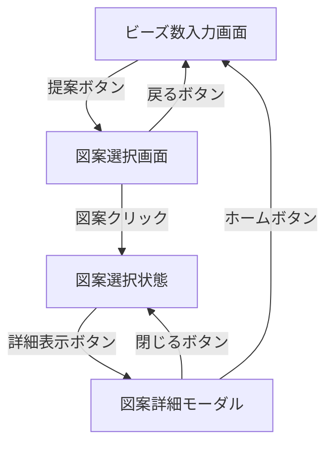

# 🎨 アイロンビーズ図案提案アプリ UI設計書

## 📱 画面構成概要

アプリは2つの主要画面で構成され、シンプルな線形フローで進行します。

```
ビーズ数入力画面 → 図案選択画面（+ 図案詳細モーダル）
```

---

## 🔢 1. ビーズ数入力画面

### 📌 目的
ユーザーが所持している色別ビーズ数を入力する画面

### 🎨 レイアウト案

```
┌───────────────────────────────────────────────────────┐
│                   アイロンビーズ                        │
│                   図案提案アプリ                        │
│                                                     │
│        手持ちのビーズ数を設定してください                   │
│                                                     │
│  🔴 赤     [-] 0 ──●────────── 256  [ 15 ] [+] 個    │
│  🟠 オレンジ [-] 0 ────●──────── 256  [ 20 ] [+] 個    │
│  🟡 黄     [-] 0 ──────●────── 256  [ 30 ] [+] 個    │
│  🟢 緑     [-] 0 ●───────────── 256  [  5 ] [+] 個    │
│  🔵 青     [-] 0 ─────●─────── 256  [ 25 ] [+] 個    │
│  🟣 紫     [-] 0 ──●────────── 256  [ 12 ] [+] 個    │
│  ⚫ 黒     [-] 0 ──────●────── 256  [ 35 ] [+] 個    │
│  ⚪ 白     [-] 0 ───────●───── 256  [ 40 ] [+] 個    │
│  🩷 ピンク   [-] 0 ────●──────── 256  [ 18 ] [+] 個    │
│  🤎 茶     [-] 0 ─●─────────── 256  [  8 ] [+] 個    │
│                                                     │
│        [ リセット ]    [ 図案を提案する ]              │
└───────────────────────────────────────────────────────┘
```

### ✨ UI要素詳細

- **タイトル**: アプリ名を中央配置
- **説明文**: 操作説明を簡潔に表示
- **トリプル入力システム**: 
  - 色の絵文字/色見本 + 色名 + ステッパー + スライダー + 数値入力欄 + 単位
  - スライダー範囲: 0〜256個
  - 数値入力欄: キーボードで直接入力可能
  - ステッパー: 細かい調整用の+/-ボタン
  - 全ての入力方法が三方向同期
  - 10色を縦に並べて表示
  - スライダーハンドルは各色に対応した色で表現
- **リセットボタン**: 全ての値を0にリセット
- **提案ボタン**: 目立つ色（青系）、右下配置

### 🎛️ トリプル入力仕様詳細

- **ステッパー（+/-ボタン）**:
  - 位置: スライダーの両端に配置
  - 機能: 1クリックで±1個、長押しで連続増減
  - デザイン: 小さめの円形ボタン、-は赤系、+は青系
  - 範囲制限: 0〜256の範囲内でのみ動作
- **スライダー**:
  - 最小値: 0個
  - 最大値: 256個（16×16の全マス分）
  - ステップ: 1個単位
  - スライダートラックは薄いグレー
  - ハンドルは各ビーズ色で色分け
- **数値入力欄**:
  - 範囲: 0〜256
  - 整数のみ受付（小数点以下切り捨て）
  - 範囲外の値は自動的に範囲内に補正
  - Enterキーで確定、Escキーでリセット
- **三方向同期**:
  - ステッパー操作 → スライダー＆数値入力欄に即座に反映
  - スライダー操作 → ステッパー表示＆数値入力欄に即座に反映
  - 数値入力 → ステッパー表示＆スライダー位置に即座に反映
- **操作性**:
  - ステッパー: クリック（±1）、長押し（連続増減）
  - スライダー: ドラッグ、クリック、キーボード（←→キー）
  - 数値入力: キーボード入力、マウスによる選択・編集

### 💭 検討事項
- ステッパーボタンのサイズとタッチしやすさ（特にモバイル）
- 長押し時の連続増減の速度調整
- 大きな数値（100個以上）のスライダー操作性
- 数値入力欄のサイズ（3桁表示に対応）
- レスポンシブ対応（モバイル時のトリプル入力の配置）
- 「よく使う設定」のプリセット機能
- 一括設定機能（例：「全て20個に設定」）
- バリデーション表示（入力値が範囲外の場合の警告）

---

## 🖼️ 2. 図案選択画面

### 📌 目的
APIから取得した図案候補（最大4件）から1つを選択する画面

### 🎨 レイアウト案

```
┌─────────────────────────────────────┐
│    ← 戻る        図案を選択            │
│                                   │
│  あなたの手持ちビーズで作れる図案です        │
│                                   │
│  ┌─────┐  ┌─────┐                 │
│  │図案1 │  │図案2 │                 │
│  │16x16│  │16x16│                 │
│  │グリッド│  │グリッド│                 │
│  │ ○選択 │  └─────┘                 │
│  └─────┘                           │
│                                   │
│  ┌─────┐  ┌─────┐                 │
│  │図案3 │  │図案4 │                 │
│  │16x16│  │16x16│                 │
│  │グリッド│  │グリッド│                 │
│  └─────┘  └─────┘                 │
│                                   │
│    [ 詳細表示 ]    [ 戻る ]          │
└─────────────────────────────────────┘

【図案詳細モーダル】
┌─────────────────────────────────────┐
│ × 閉じる     図案詳細     🏠 ホーム    │
│                                   │
│  ┌─┬─┬─┬─┬─┬─┬─┬─┬─┬─┬─┬─┬─┬─┬─┬─┐ │
│  │🔴│⚪│🔴│⚪│🔴│⚪│🔴│⚪│🔴│⚪│🔴│⚪│🔴│⚪│🔴│⚪│ │
│  ├─┼─┼─┼─┼─┼─┼─┼─┼─┼─┼─┼─┼─┼─┼─┼─┤ │
│  │⚪│🔴│⚪│🔴│⚪│🔴│⚪│🔴│⚪│🔴│⚪│🔴│⚪│🔴│⚪│🔴│ │
│  ├─┼─┼─┼─┼─┼─┼─┼─┼─┼─┼─┼─┼─┼─┼─┼─┤ │
│  │🔴│⚪│🔴│⚪│🔴│⚪│🔴│⚪│🔴│⚪│🔴│⚪│🔴│⚪│🔴│⚪│ │
│  │・│・│・│・│・│・│・│・│・│・│・│・│・│・│・│・│ │
│  │・│・│・│・│・│・│・│・│・│・│・│・│・│・│・│・│ │
│  └─┴─┴─┴─┴─┴─┴─┴─┴─┴─┴─┴─┴─┴─┴─┴─┘ │
│                                   │
│          必要なビーズ:               │
│    🔴 赤: 128個  ⚪ 白: 128個        │
└─────────────────────────────────────┘
```

### ✨ UI要素詳細

#### メイン画面
- **ナビゲーション**: 戻るボタン + 画面タイトル
- **説明文**: 結果の概要を表示
- **図案グリッド**: 2x2で最大4つの図案を表示
  - 各図案は16x16の小さなグリッドで表現
  - クリック/タップで選択状態に変更
  - 選択された図案には選択マーカー（○選択）を表示
  - ホバー効果で選択可能性を示唆
- **アクションボタン**: 
  - 詳細表示ボタン: 選択された図案をモーダルで詳細表示
  - 戻るボタン: ビーズ数入力画面に戻る

#### 図案詳細モーダル
- **ナビゲーション**: 閉じるボタン + タイトル + ホームボタン
- **メイングリッド**: 16x16の大きなグリッド表示
  - 各セルは色でビーズを表現
  - セル間に境界線を表示
  - モーダル内で最大限に表示
- **必要ビーズ数**: 実際に必要な色別ビーズ数を表示

### 🎛️ モーダル仕様詳細

- **表示トリガー**: 図案選択後に「詳細表示」ボタンをクリック
- **モーダルサイズ**: 画面の80-90%を占有、レスポンシブ対応
- **背景**: 半透明のオーバーレイでメイン画面を暗くする
- **閉じる方法**: 
  - 閉じるボタン（×）
  - ホームボタン（🏠）でビーズ数入力画面に戻る
  - 背景クリック（オプション）
  - Escキー
- **グリッド表示**: 
  - 16x16の実用的なサイズで表示
  - 作品制作時に参照しやすいよう最適化
- **アクセシビリティ**: 
  - フォーカストラップ対応
  - キーボードナビゲーション対応

### 💭 検討事項
- 図案が4件未満の場合の表示
- 図案のプレビューサイズ（視認性 vs 表示領域）
- 図案にタイトル/ID表示の必要性
- 選択状態の視覚的表現（枠線の色、背景色の変更など）
- モーダルのアニメーション（フェードイン・アウト）
- モバイルでのモーダル表示とスクロール対応

---

## 🔄 画面遷移フロー



## 🎨 デザインシステム

### 🎯 色彩設計
- **プライマリカラー**: 青系（#2563EB）- ボタン、リンク
- **セカンダリカラー**: グレー系（#64748B）- テキスト、境界線
- **アクセントカラー**: 各ビーズ色を忠実に再現

### 📱 レスポンシブ対応
- **デスクトップ**: 3画面とも中央寄せレイアウト
- **タブレット**: グリッド表示の調整
- **モバイル**: 縦スクロール対応、ボタンサイズ拡大

### 🔤 タイポグラフィ
- **見出し**: 太字、大きめサイズ
- **本文**: 読みやすい標準サイズ
- **キャプション**: 小さめ、グレー色

---

##  Next Steps

1. **フィードバック収集**: この初期設計に対する意見
2. **詳細仕様決定**: 色の表現方法、サイズ、アニメーション
3. **プロトタイプ作成**: Figma等でのモックアップ
4. **実装フェーズ**: Next.jsでのコンポーネント開発

---

*このドキュメントは対話しながら随時更新していきます 📝*
